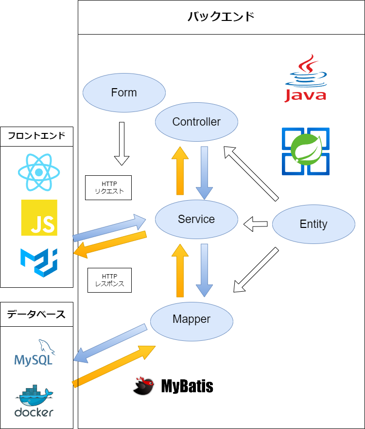
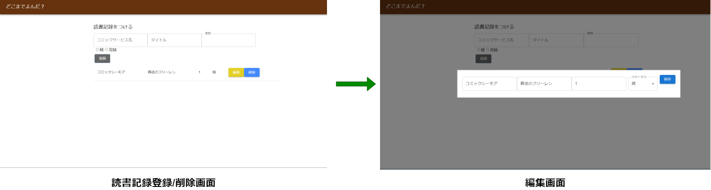
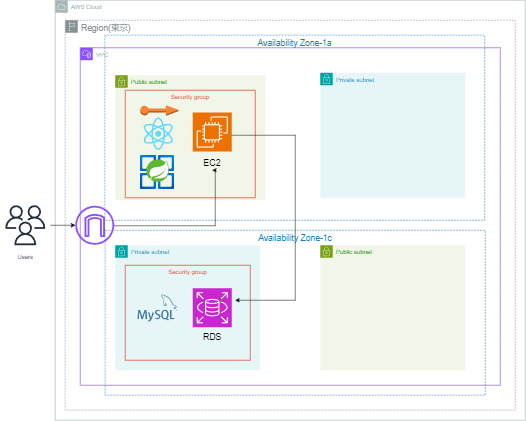

# 読書記録管理アプリ

## 概要

本アプリは、読書記録を管理するアプリです。

今まで読んだ読書記録の登録、編集、削除が出来ます。

## 作成背景

昨今のコミック配信サービスは多岐に渡り、様々なサービスを利用している内に把握が困難になりがちです。  
そんな悩みを解決する為、

- どの配信サービスで
- 何の漫画を
- 何巻まで読了したか  
  という情報を一元的に管理出来るようにしました。

## 使用技術

- バックエンド
  - Java 17.0.9
  - SpringBoot 3.1.6
  - MyBatis
- フロントエンド
  - React 18.2.0(JavaScript)
  - [Material UI](https://mui.com/)
- その他

  - MySQL 8.0.35
  - Docker 23.0.5
  - 自動テスト
  - CI (Checkstyle, 自動テストを実行)
  - AWS デプロイ

  ## アプリケーション概略図

  

  ## アプリケーション機能一覧

  - 読書記録登録機能  
    読んだコミックの「コミックサービス名」、「タイトル」、「巻数」、まだ続いている作品か完結済みか状態を登録できる。
  - 編集機能  
    登録した情報を編集できる。
  - 削除機能  
    登録した情報を削除できる。

  ## 使用イメージ

  ### 読書記録登録

  

### 編集機能

### 削除機能

## 画面遷移図

## API 仕様書

[swagger を用いた API 仕様書](https://kana2212.github.io/ComicLogAPI/)

## インフラ構成図

## ローカルでのアプリケーション起動方法

- Git, Java, Node.js, Docker をインストールする。

- リポジトリを git clone する。  
  `git clone https://github.com/kana2212/ComicLogAPI.git`

- クローンしたディレクトリに移動する。

- Docker を起動する。  
  `docker compose up`

- Spring Boot を起動する。  
  `./gradlew bootRun`

- frontend ディレクトリに移動する。  
  `cd frontend/`

- 依存関係をインストールし、React のアプリケーションを起動す る。  
  `npm install`  
  `npm start`

## 苦労した事

初めは機能の実装とレイアウトをどう結びつけるのかが想像出来ず苦労しました。他の方の実装を何人も比較・研究し,探りつつ開発を進めました。  
各 Hooks の知識から使用方法、非同期処理など理解する事に時間がかかり、バケツリレーの回避なども難しさを感じました。
AWS へのデプロイの際も CORS エラーや API リクエストエラーに悩まされましたが、
最終的には苦戦しながらもフロントエンドとバックエンドをどちらも実装出来たことで大変良い学びになりました。

## 振り返り

システム設計の段階で、欲しい機能や構成がいかに考えられているかという重要性を身に染みて感じました。フロントエンドは初めての実装だったとは言え、自分の理解度の低さに構成を何度も検討し直さなければならず、見積もりの甘さに時間を使ってしまいました。  
普段からのアウトプットで手を動かし、対処法の引き出しを増やしていこうと思います。

## 今後の展望

- ログイン機能
- ログイン先の本実装で検索機能を追加する
- 巻数の数字を選択する際、0 以下の数字を選べないよう制限する
- TypeScript 化
